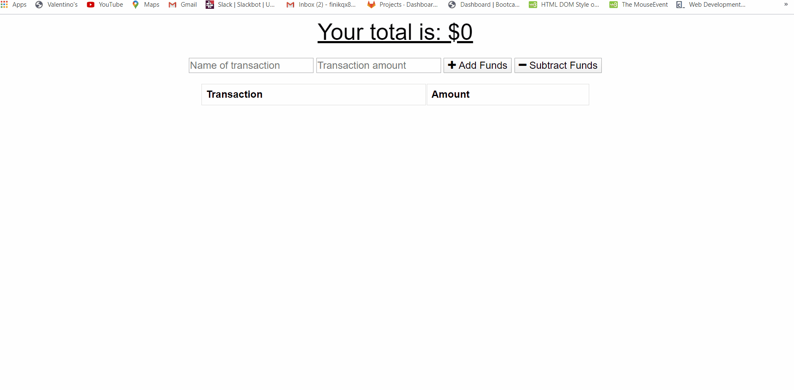

# Online-Offline_Budget_Trackers

This application giving users a fast and easy way to track their money is important, but allowing them to access that information anytime is even more important. Having offline functionality is paramount to our applications success.

## How to Use
1. Run NPM INSTALL in the terminal
2. Run NPM START

# Repository access link

https://github.com/Ravil822/Online-Offline_Budget_Trackers

# Deployed app link

https://powerful-wave-66709.herokuapp.com/

# Output Demo

# Terms

THE SOFTWARE IS PROVIDED "AS IS", WITHOUT WARRANTY OF ANY KIND, EXPRESS OR IMPLIED, INCLUDING BUT NOT LIMITED TO THE WARRANTIES OF MERCHANTABILITY, FITNESS FOR A PARTICULAR PURPOSE AND NONINFRINGEMENT. IN NO EVENT SHALL THE AUTHORS OR COPYRIGHT HOLDERS BE LIABLE FOR ANY CLAIM, DAMAGES OR OTHER LIABILITY, WHETHER IN AN ACTION OF CONTRACT, TORT OR OTHERWISE, ARISING FROM, OUT OF OR IN CONNECTION WITH THE SOFTWARE OR THE USE OR OTHER DEALINGS IN THE SOFTWARE.